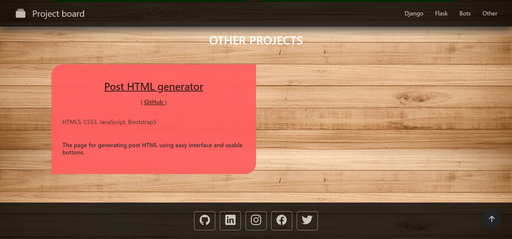

_Page for displaying all my deployed projects_

### Demo

Click **<a href="https://portfolio.hubariev.com/" target="_blank">here</a>** to open my project board page

            
### License

[Project-board](https://github.com/Gubchik123/Project-board) is licensed under the [MIT License](https://github.com/Gubchik123/Project-board/blob/master/LICENSE.md).
            
### Contributing

Feel free to contribute.

You can create an [issue](https://github.com/Gubchik123/Project-board/issues/new) to report a bug, suggest an improvement for this plugin, ask a question, etc.

You can make a [pull request](https://github.com/Gubchik123/Project-board/compare) to contribute to this bot development.

 

### Support

If you like this project, you can support me to help me keep working on projects.

Buy me coffee on [buymeacoffee.com/Gubchik123](https://www.buymeacoffee.com/Gubchik123)

